# agkozak Zsh Prompt

[](https://opensource.org/licenses/MIT)
[](https://GitHub.com/agkozak/agkozak-zsh-prompt/tags/)

[](https://github.com/agkozak/agkozak-zsh-prompt/stargazers)
[](https://gitter.im/agkozak-zsh-prompt/Lobby#)

The agkozak Zsh Prompt is an asynchronous color Git prompt that uses basic ASCII symbols to show:

* the exit status of the last command, if it was not zero
* the execution time of the last command
* the username
* whether a session is local, or remote over SSH or `mosh`; the latter state is indicated by the name of the remote machine
* an abbreviated path
* any active virtual environment
* Git branch and status
* the number of background processes
* if `vi` line editing is enabled, whether insert or command mode is active

This prompt has been tested on numerous Linux and BSD distributions, as well as on Solaris, and in Windows environments (MSYS2, Cygwin, and WSL). It should also work perfectly on MacOS.


## Table of Contents

- [News](#news)
- [Installation](#installation)
- [Local and Remote Sessions](#local-and-remote-sessions)
- [Abbreviated Paths](#abbreviated-paths)
- [Command Execution Time](#command-execution-time)
- [Git Branch and Status](#git-branch-and-status)
- [Background Jobs Status](#background-jobs-status)
- [Exit Status](#exit-status)
- [Virtual Environments](#virtual-environments)
- [`vi` Editing Mode](#vi-editing-mode)
- [Asynchronous Methods](#asynchronous-methods)
- [Customization](#customization)
    - [Custom Colors](#custom-colors)
    - [Blank Lines Between Prompts](#blank-lines-between-prompts)
    - [Optional Single-line Prompt](#optional-single-line-prompt)
    - [Optional Left-prompt-only Mode](#optional-left-prompt-only-mode)
    - [Custom Prompt Character](#custom-prompt-character)
    - [Custom Git Symbols](#custom-git-symbols)
    - [Other Settings](#other-settings)
        - [`AGKOZAK_USER_HOST_DISPLAY`](#agkozak_user_host_display)
        - [`AGKOZAK_BRANCH_STATUS_SEPARATOR`](#agkozak_branch_status_separator)
        - [`AGKOZAK_SHOW_STASH`](#agkozak_show_stash)
    - [Advanced Customization](#advanced-customization)
- [Examples of agkozak Zsh Prompt Customization](#examples-of-agkozak-zsh-prompt-customization)
    - [Using Basic Configuration Settings](#using-basic-configuration-settings)
    - [Using AGKOZAK_CUSTOM_PROMPT and AGKOZAK_CUSTOM_RPROMPT](#using-agkozak_custom_prompt-and-agkozak_custom_rprompt)
- [Options Index](#options-index)
- [`psvar` Index](#psvar-index)

## News

<details>
  <summary>Here are the latest features and updates.</summary>

- v3.11.1
    + Bug fix: The background jobs indicator was not updating immediately when a job ended. The prompt now uses the native Zsh `%j` escape to fetch the number of background jobs. Please update your custom prompts accordingly; the examples below have all been updated.
- v3.11.0
    + Added a background jobs indicator (props to [@crai0](https://github.com/crai0/)).
    + The `usr1` async method is used preferred whenever possible, as it reduces command lag considerably (props to [@romkatv](https://github.com/romkatv/) for sharing [his benchmarking system](https://github.com/romkatv/zsh-bench)).
- v3.10.4
    + Mere orthographical changes: "ZSH" is now "Zsh" throughout.
- v3.10.3
    + Fixed a bug associated with unloading the prompt on Zsh < v5.30.
- v3.10.2
    + The unload function now works on Zsh versions earlier than 5.3.0 without any error messages.
- v3.10.1
    + The prompt now supports `promptinit`'s `prompt_cleanup` function.
- v3.10.0
    + The prompt is now fully compatible with ZSH's `promptinit` function.
- v3.9.0
    - The characters used to signify path abbreviation with `AGKOZAK_PROMPT_DIRTRIM` (`...` by default) can now be overridden with `AGKOZAK_PROMPT_DIRTRIM_STRING`.
- v3.8.1 (November 23, 2020)
    - WSL2 now uses the `subst-async` method, while WSL1 continues to use `usr1` for reasons of speed.
    - The error message `permission denied: /proc/version` is no longer produced in `termux` on Android.
    - zsh-async v1.8.5 is included.
- v3.8.0 (July 9, 2020)
    - The prompt no longer defaults to `zsh-async` on Solaris and Solaris-derived operating systems, as I have noticed that `zsh-async`'s performance can be quirky on underperforming systems.
- v3.7.3 (May 14, 2020)
    - Updated to use zsh-async 1.8.3.
- v3.7.2 (May 6, 2020)
    - `_agkozak_precmd` was triggering a warning on Zsh v5.0.0-2. This has been fixed.
    - Version 1.8.0 of zsh-async is now being used.
- v3.7.1 (January 24, 2020)
    - `AGKOZAK_CMD_EXEC_TIME_CHARS` and `AGKOZAK_VIRTUALENV_CHARS` were being set back to default if they were set before the prompt was sourced.
- v3.7.0 (January 21, 2020)
    - The agkozak Zsh Prompt now includes an indicator for Python virtual environments created with `virtualenv`, `python -m venv`, `pipenv`, `poetry`, and `conda`.
    - I have moved the command execution time indicator back towards the beginning of the prompt, right after the exit status indicator.
- v3.6.0 (January 4, 2020)
    - There is now a [command execution time indicator](#command-execution-time).
    - There are more `psvar` elements available to custom prompts. See [the new documentation of `psvar` prompt strings](#psvar-index).
    - By popular demand, it is now possible to use `AGKOZAK_LEFT_PROMPT_ONLY=1` with `AGKOZAK_MULTILINE=0`, although the two options together may be visually unappealing on a slow system or when working with very large Git repos.
    - Asynchronous method improvements: `subst-async` has been tweaked to provide more stability and speed on all systems. `usr1` has been made faster through the elimination of a subshell. It is now the default asynchronous method in all Windows environments.
    - I have provided the code for [my own Zenburn custom prompt](#my-zenburn-custom-prompt).
- v3.5.0 (November 15, 2019)
    - The prompt now supports the [zdharma Zsh plugin unload function standard](https://github.com/agkozak/Zsh-100-Commits-Club/blob/master/Zsh-Plugin-Standard.adoc#unload-fun) which is currently implemented by the zplugin framework. When the function `agkozak-zsh-prompt_plugin_unload` is invoked, the state of the shell before agkozak-zsh-prompt was loaded is restored.
    - For debugging purposes, `WARN_CREATE_GLOBAL` is now applied to individual functions whether or not debugging mode is enabled. On Zsh v5.4.0+ and when `AGKOZAK_PROMPT_DEBUG` is set to `1`, all functions have `WARN_NESTED_VAR` applied to them.
    - Measures have been taken to avoid problems when the shell options `KSH_ARRAYS` and `SH_WORD_SPLIT` have been enabled.
    - When loaded on terminals without color, the prompt avoids using subshells when eliminating color codes from the `PROMPT` and `RPROMPT` strings.
- v3.4.0 (November 6, 2019)
    - Stashed changes are now displayed by default (set `AGKOZAK_SHOW_STASH=0` to turn this feature off).
    - In a single-line prompt, `AGKOZAK_PRE_PROMPT_CHAR` allows you to change the space before the prompt character to any character or characters you like; setting `AGKOZAK_PRE_PROMPT_CHAR=''` eliminates the space entirely.
- v3.3.0 (July 20, 2019)
    - If `AGKOZAK_USER_HOST_DISPLAY=0`, the username and hostname will not be displayed.
- v3.2.2 (July 8, 2019)
    - When the local `git` version is 2.15.0 or greater, `git status` will not run unnecessary optional operations that require locks.
- v3.2.1 (May 6, 2019)
    - For Zsh v5.0.2, `subst-async` now works correctly, but `usr1` will be used as the default async method, as it should be slightly faster.
- v3.2.0 (February 28, 2019)
    - By default, a space precedes the Git branch status indicator. The space can now be eliminated by setting `AGKOZAK_BRANCH_STATUS_SEPARATOR=''`, or changed to another character or characters (e.g. `AGKOZAK_BRANCH_STATUS_SEPARATOR='--'`).
- v3.1.0 (February 5, 2019)
    - The array `AGKOZAK_PROMPT_CHAR` allows the user to specify prompt characters for regular user, superuser, and `vi` command mode.
    - Setting `AGKOZAK_COLORS_PROMPT_CHAR` can change the color of the prompt character.
    - The array `AGKOZAK_CUSTOM_SYMBOLS` contains user-specified symbols for displaying the Git status.
- v3.0.2 (December 26, 2018)
    - The external command `cat` is no longer used.
    - The prompt now uses [the latest commit](https://github.com/mafredri/zsh-async/commit/43de5e0738eaf366dfde4d0a204de655de16f18b) of `zsh-async`.
- v3.0.1 (November 26, 2018)
    - I have restored the `_agkozak_vi_mode_indicator` function as a legacy feature, as many people people use it in custom prompts. The default indicator can be expressed as `'%(4V.:.%#)'`, though, and variations on this will be preferable to `'$(_agkozak_vi_mode_indicator)'`, which entails a subshell.
- v3.0.0 (November 26, 2018)
    - The asynchronous Git status is now available via process substitution in all supported versions of Zsh and on all supported systems (props to @psprint). For reasons of speed, `zsh-async` remains the default asynchronous method in WSL and Solaris, and `usr1` is default in MSYS2/Cygwin.
    - When `AGKOZAK_LEFT_PROMPT_ONLY` is set to `1`, the Git status is displayed in the left prompt, and the right prompt is left blank.
    - The prompt script loads up to 4x faster.
    - The left prompt is displayed ~2x faster.

</details>

## Installation

### For users without a framework

The agkozak Zsh prompt requires no framework and can be simply sourced from your `.zshrc` file. Clone the git repo:

    git clone https://github.com/agkozak/agkozak-zsh-prompt

And add the following to your `.zshrc` file:

    source /path/to/agkozak-zsh-prompt.plugin.zsh

### For [`promptinit`](https://zsh.sourceforge.io/Doc/Release/User-Contributions.html#Prompt-Themes) users

Zsh comes with a built-in way of handling prompts, the `promptinit` function. You can load the agkozak Zsh prompt by running

    fpath+=( /path/to/agkozak-zsh-prompt )  # The directory where the prompt's
                                            # files are kept
    autoload promptinit; promptinit
    prompt agkozak-zsh-prompt

### For [antigen](https://github.com/zsh-users/antigen) users

Add the line

    antigen bundle agkozak/agkozak-zsh-prompt

to your `.zshrc`, somewhere before the line that says `antigen apply`. Be sure to use `antigen bundle` and not `antigen theme`.

### For [oh-my-zsh](http://ohmyz.sh) users

Execute the following commands:

    [[ ! -d $ZSH_CUSTOM/themes ]] && mkdir $ZSH_CUSTOM/themes
    git clone https://github.com/agkozak/agkozak-zsh-prompt $ZSH_CUSTOM/themes/agkozak
    ln -s $ZSH_CUSTOM/themes/agkozak/agkozak-zsh-prompt.plugin.zsh $ZSH_CUSTOM/themes/agkozak.zsh-theme

And set `ZSH_THEME=agkozak` in your `.zshrc` file.

### For [zcomet](https://github.com/agkozak/zcomet) users

Add

    zcomet load agkozak/agkozak-zsh-prompt

to your `.zshrc` (below where you source `zcomet.zsh` and above where you run `zcomet compinit`). If you like to use `promptinit` for prompt-switching, you can do

    zcomet fpath agkozak/agkozak-zsh-prompt
    autoload promptinit; promptinit
    prompt agkozak-zsh-prompt

### For [zgen](https://github.com/tarjoilija/zgen) users

Add the line

    zgen load agkozak/agkozak-zsh-prompt

to your `.zshrc` somewhere before the line that says `zgen save`.

### For Zinit (formerly `zplugin`) users

Run the command

    zinit load agkozak/agkozak-zsh-prompt

to try out the prompt; add the same command to your `.zshrc` to load it automatically when the shell starts.

The prompt now supports `zinit`'s `unload` feature; you may restore the shell to its state before loading the prompt by running

    zinit unload agkozak/agkozak-zsh-prompt

### For [Znap](https://github.com/marlonrichert/zsh-snap) users

Simply put

    znap prompt agkozak/agkozak-zsh-prompt

in your `.zshrc` somewhere after you source `znap.zsh`.

### For [zplug](https://github.com/zplug/zplug) users

Add the line

    zplug "agkozak/agkozak-zsh-prompt"

to your `.zshrc` somewhere before the line that says `zplug load`.

## Exit Status

If the exit status of the most recently executed command is other than zero (zero indicating success), the exit status will be displayed at the beginning of the left prompt:

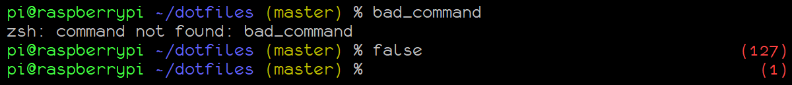

## Command Execution Time


The prompt will display the execution time of the last command if it exceeds a certain threshold (`AGKOZAK_CMD_EXEC_TIME`, which defaults to `5` seconds). Setting `AGKOZAK_CMD_EXEC_TIME=0` will disable the display of this indicator entirely. The color can be set using `AGKOZAK_COLORS_CMD_EXEC_TIME`, which is normally `default` (the default text color). An array, `AGKOZAK_CMD_EXEC_TIME_CHARS`, can contain two strings to prepend and append to the command execution time string; for example,

    AGKOZAK_CMD_EXEC_TIME_CHARS=( '[' ']' )

will surround the time string with square brackets.

## Local and Remote Sessions

When a session is local, only the username is shown; when it is remote over SSH (or `mosh`), the hostname is also shown:

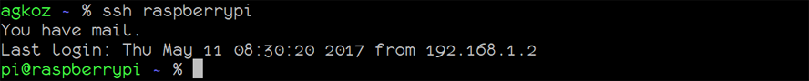

*Note: It is exceedingly difficult to determine with accuracy whether a superuser is connected over SSH or not. In the interests of providing useful and not misleading information, this prompt always displays both username and hostname for a superuser in reverse video.*

## Abbreviated Paths

By default the agkozak Zsh Prompt emulates the behavior that `bash` uses when `PROMPT_DIRTRIM` is set to `2`: a tilde (`~`) is prepended if the working directory is under the user's home directory, and then if more than two directory elements need to be shown, only the last two are displayed, along with an ellipsis, so that

    /home/pi/src/neovim/config

is displayed as


whereas

    /usr/src/sense-hat/examples

is displayed as

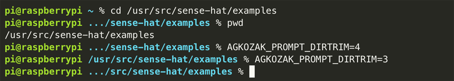

that is, without a tilde.

If you would like to display a different number of directory elements, set the environment variable `AGKOZAK_PROMPT_DIRTRIM` in your `.zshrc` file thus (as in the example below):

    AGKOZAK_PROMPT_DIRTRIM=4     # Or whatever number you like

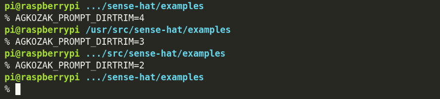

Setting `AGKOZAK_PROMPT_DIRTRIM=0` will turn off path abbreviation, with the exception of `~` for `$HOME` and named directories (see immediately below).

By default, [static named directories created with `hash -d`](http://zsh.sourceforge.net/Doc/Release/Expansion.html#Static-named-directories) will be used as base directories in the path the prompt displays. For example,
if you have executed

    hash -d wp-content=/var/www/html/wp-content

then `/var/www/html/wp-content` will appear in the prompt as `wp-content`, and `/var/www/html/wp-content/plugins/redirection/actions` will be represented as `~wp-content/.../redirection/actions`. If you prefer to have named directories displayed just like any others, set `AGKOZAK_NAMED_DIRS=0`.

If you want to use a string other than `...` to signify that a path has been abbreviated, you may specify it using `AGKOZAK_PROMPT_DIRTRIM_STRING`. For example,

    AGKOZAK_PROMPT_DIRTRIM_STRING=$'\u2026'

will replace the default three dots (`...`) with a Unicode ellipsis (`…`), which can free up a little screen space if your terminal font supports it.

## Virtual Environments


If a virtual environment created by `virtualenv`, `python -m venv`, `pipenv`, `poetry`, or `conda` is activated, by default it will be displayed to the right of the path. Display of the virtual environment indicator may be disabled with `AGKOZAK_SHOW_VIRTUALENV=0`. The color of the indicator can be changed using the variable `AGKOZAK_COLORS_VIRTUALENV` (default: `green`). The virtual environment name is normally surrounded by square brackets, but the characters used can be changed using the array `AGKOZAK_VIRTUALENV_CHARS`; for example

    AGKOZAK_VIRTUALENV_CHARS=( '(' ')' )

will use parentheses, while

    AGKOZAK_VIRTUALENV_CHARS=( '' '' )

will display just the virtual environment name without any surrounding characters.

## Git Branch and Status

If the current directory contains a Git repository, the agkozak Zsh Prompt displays the name of the working branch, along with some symbols to show changes to its status:

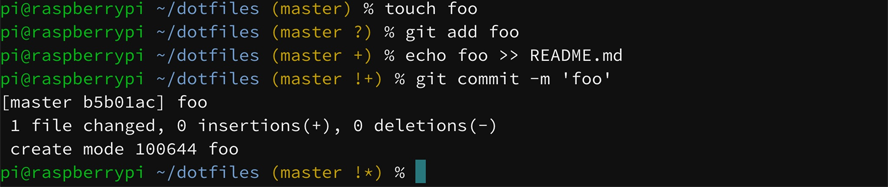

Git Status | Symbol
--- | ---
Diverged | &\*
Behind | &
Ahead | \*
New file(s) | +
Deleted | x
Modified | !
Renamed | >
Untracked | ?
Stashed changes | $

## Background Jobs Status

If you have background jobs running (a suspended editor, for example), the prompt will display the number of such jobs followed by a `j`:

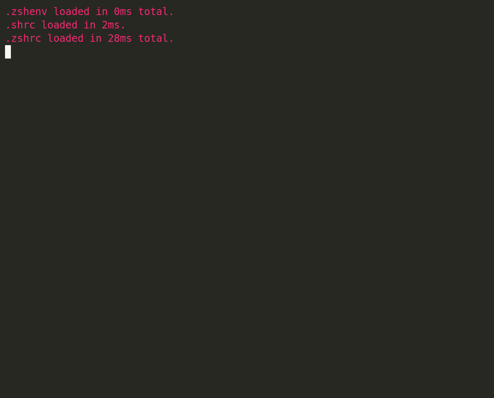
You can customize the background jobs display by setting `AGKOZAK_COLORS_BG_STRING` to the color you would like it to have or `AGKOZAK_BG_STRING` to the character or characters you want to use to denote background jobs (you could set `AGKOZAK_BG_STRING=bg`, for example).


## `vi` Editing Mode

The agkozak Zsh Prompt indicates when the user has switched from `vi` insert mode to command mode by turning the `%` or `#` of the prompt into a colon:

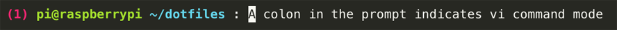

agkozak does not enable `vi` editing mode for you. To do so, add

    bindkey -v

to your `.zshrc`.

This prompt will still work perfectly if you use the default Zsh Emacs editing mode; in that case, the prompt character will not change.

## Asynchronous Methods

The agkozak Zsh Prompt chooses the fastest and most reliable of three different methods for displaying the Git status asynchronously. The default `usr1` method, first described by [Anish Athalye](http://www.anishathalye.com/2015/02/07/an-asynchronous-shell-prompt/), creates and disowns child processes that calculate the Git status and then kill themselves off, triggering `SIGUSR1` in the process. The Zsh `TRAPUSR1` trap function then displays that Git status. Since other scripts or the user could conceivably define `TRAPUSR1` either before or after this prompt is loaded, it regularly checks to see if that is the case and, if so, falls back to the slower but entirely reliable `subst-async` method, which is also used if `SIGUSR1` is not available.

I have tweaked [@psprint](https://github.com/psprint)'s `subst-async` technique to work on all known platforms and with all supported versions of Zsh. It uses process substitution (`<( ... )`) to fork a background process that fetches the Git status and feeds it to a file descriptor. A `zle -F` callback handler then processes the input from the file descriptor and uses it to update the prompt.

This prompt also supplies a `zsh-async` method that relies on the [`zsh-async`](https://github.com/mafredri/zsh-async) library, which uses ZSH's `zsh/zpty` module to spin off pseudo-terminals that can calculate the Git status without blocking the user from continuing to use the terminal. `zsh/zpty` does not work well with Cygwin or MSYS2, however, and it can be quirky on Solaris and related operating systems, so it is no longer used by default, and is only provided for those who want it.

If you want to force the agkozak Zsh Prompt to use a specific asynchronous method (or none at all), execute `export AGKOZAK_FORCE_ASYNC_METHOD=subst-async`, `zsh-async`, `usr1`, or `none` before sourcing it. If you want more insight into how the prompt is working in your shell, put `export AGKOZAK_PROMPT_DEBUG=1` in your `.zshrc` before the code loading this prompt.

## Customization

In addition to setting `AGKOZAK_PROMPT_DIRTRIM` and `AGKOZAK_NAMED_DIRS` to change how the working directory is displayed ([see above](#abbreviated-paths)), you may use other settings to alter how the prompt is displayed. For some examples of prompt configurations people have created using simple combinations of options, see ["Using Basic Configuration Settings"](#using-basic-configuration-settings).

### Custom Colors
If you would like to customize the prompt colors, change any of the `AGKOZAK_COLORS_*` variables from their defaults to any valid color and add it to your `.zshrc`. The following are the available color variables and their defaults:

    AGKOZAK_COLORS_EXIT_STATUS=red
    AGKOZAK_COLORS_USER_HOST=green
    AGKOZAK_COLORS_PATH=blue
    AGKOZAK_COLORS_BRANCH_STATUS=yellow
    AGKOZAK_COLORS_PROMPT_CHAR=default      # Default text color
    AGKOZAK_COLORS_CMD_EXEC_TIME=default    # Default text color
    AGKOZAK_COLORS_VIRTUALENV=green
    AGKOZAK_COLORS_BG_STRING=magenta


### Blank Lines Between Prompts

If you prefer to have a little space between instances of the prompt, put `AGKOZAK_BLANK_LINES=1` in your `.zshrc`:

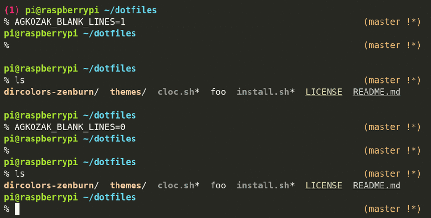

### Optional Single-line Prompt

If you prefer a single-line prompt with a right prompt that disappears when it is typed over, put

    AGKOZAK_MULTILINE=0

in your `.zshrc`.


If you would prefer to have a character or characters other than a space appear before the prompt character, set `AGKOZAK_PRE_PROMPT_CHAR` to that character or characters -- or set `AGKOZAK_PRE_PROMPT_CHAR=''` to eliminate the space.

### Optional Left-prompt-only Mode

If you would like to have the Git status displayed in the left prompt (with no right prompt -- this is how [`pure`](https://github.com/sindresorhus/pure) does it), set

    AGKOZAK_LEFT_PROMPT_ONLY=1

*Note: it is possible to combine `AGKOZAK_MULTILINE=0` with `AGKOZAK_LEFT_PROMPT_ONLY=1`, but the result may be visually unappealing.*


### Custom Prompt Character

The classic prompt for Bourne-style shells is `$`; for `csh` it is `%`, and Zsh borrows the latter because it inherits features from both types of shell. agkozak-zsh-prompt uses `%` to show where the prompt ends and where input should begin, although a superuser will see `#`, and either sort of user will see `:` when `vi` command mode is active. If you wish to change any or all of these symbols, you may do so using the array `AGKOZAK_PROMPT_CHAR`, whose three elements are 1) the normal prompt character; 2) the superuser prompt character; and 3) the `vi` command mode character. The default behavior of the prompt can be represented as

    AGKOZAK_PROMPT_CHAR=( %# %# : )

If you would like your prompt to look more like a `bash` prompt (i.e. terminating in `$`), you can simply put the following in your `.zshrc`:

    AGKOZAK_PROMPT_CHAR=( $ %# : )

Some people prefer to spruce up their prompts with unicode characters. You could approximate the appearance of the popular [pure](https://github.com/sindresorhus/pure) prompt by using

    AGKOZAK_PROMPT_CHAR=( ❯ ❯ ❮ )

Closer still to pure would be

    AGKOZAK_PROMPT_CHAR=( ❯ ❯ ❮ )
    AGKOZAK_COLORS_PROMPT_CHAR='magenta'

which would be the equivalent of

    AGKOZAK_PROMPT_CHAR=( '%F{magenta}❯%f' '%F{magenta}❯%f' '%F{magenta}❮%f' )

Note that you could change one of those `%F{magenta}...%f` strings to another foreground color for a more striking visual reminder of what you are doing at any given moment.


### Custom Git Symbols

If, through the use of another prompt, your muscle memory has been trained to react immediately to a particular set of Git status symbols, or if you have an aesthetic preference for symbols other than the default ASCII ones, you may specify them in the array `AGKOZAK_CUSTOM_SYMBOLS`. The default set is

    AGKOZAK_CUSTOM_SYMBOLS=( '&*' '&' '*' '+' 'x' '!' '>' '?' '$')

If you prefer the [pure](https://github.com/sindresorhus/pure) symbols for the "diverged," "behind," and "ahead" states, you could use the following settings:

    AGKOZAK_CUSTOM_SYMBOLS=( '⇣⇡' '⇣' '⇡' '+' 'x' '!' '>' '?' 'S')

### Other Settings

#### `AGKOZAK_USER_HOST_DISPLAY`


For a more streamlined prompt, you may choose to suppress the display of the username and hostname by setting

    AGKOZAK_USER_HOST_DISPLAY=0

#### `AGKOZAK_BRANCH_STATUS_SEPARATOR`

By default, when you set `AGKOZAK_LEFT_PROMPT_ONLY=1`, a space precedes the Git branch status indicator, typically right between it and the directory name. You may eliminate the space by setting

    AGKOZAK_BRANCH_STATUS_SEPARATOR=''

Alternatively, you may set `AGKOZAK_BRANCH_STATUS_SEPARATOR` to any other character or characters that you prefer.

#### `AGKOZAK_SHOW_STASH`

If you prefer not to have stashed changes displayed, you may set `AGKOZAK_SHOW_STASH=0`.

### Advanced Customization
If you would like to make further customizations to your prompt, you may use the variables `AGKOZAK_CUSTOM_PROMPT` and `AGKOZAK_CUSTOM_RPROMPT` to specify the exact strings to be used for the left and right prompts. The default prompts, with the default settings, can be expressed as

```sh
# The left prompt

# Exit status
AGKOZAK_CUSTOM_PROMPT='%(?..%B%F{red}(%?%)%f%b )'
# Command execution time
AGKOZAK_CUSTOM_PROMPT+='%(9V.%9v .)'
# Username and hostname
AGKOZAK_CUSTOM_PROMPT+='%(!.%S%B.%B%F{green})%n%1v%(!.%b%s.%f%b) '
# Path
AGKOZAK_CUSTOM_PROMPT+=$'%B%F{blue}%2v%f%b'
# Virtual environment
AGKOZAK_CUSTOM_PROMPT+='%(10V. %F{green}[%10v]%f.)'
# Background jobs indicator and newline
AGKOZAK_CUSTOM_PROMPT+=$'%(1j. %F{magenta}%jj%f.)\n'
# Prompt character
AGKOZAK_CUSTOM_PROMPT+='%(4V.:.%#) '

# The right prompt

# Git status
AGKOZAK_CUSTOM_RPROMPT='%(3V.%F{yellow}%3v%f.)'
```

In general, you will not need to change these settings to achieve a custom prompt. If, for example, you would like to move the Git status into the left prompt, you may do so simply with `AGKOZAK_LEFT_PROMPT_ONLY=1`. If you want to make it your favorite shade of grey, you may add `AGKOZAK_COLORS_BRANCH_STATUS=243`.

If you made those customizations, however,  the right prompt would no longer do anything, so you could use the `AGKOZAK_CUSTOM_RPROMPT` variable to have it do something new, such as to display the time:

     AGKOZAK_CUSTOM_RPROMPT='%*'

So far, you will have used only the following code:

    AGKOZAK_LEFT_PROMPT_ONLY=1
    AGKOZAK_COLORS_BRANCH_STATUS=243 
    AGKOZAK_CUSTOM_RPROMPT='%*'

The same result could be achieved by starting with the default code given at the top of this section and altering it to produce

```sh
# The left prompt

# Exit status
AGKOZAK_CUSTOM_PROMPT='%(?..%B%F{red}(%?%)%f%b )'
# Command execution time
AGKOZAK_CUSTOM_PROMPT+='%(9V.%9v .)'
# Username and hostname
AGKOZAK_CUSTOM_PROMPT+='%(!.%S%B.%B%F{green})%n%1v%(!.%b%s.%f%b) '
# Path
AGKOZAK_CUSTOM_PROMPT+='%B%F{blue}%2v%f%b'
# Virtual environment
AGKOZAK_CUSTOM_PROMPT+='%(10V. %F{green}[%10v]%f.)'
# Background jobs indicator and newline
AGKOZAK_CUSTOM_PROMPT+='%(1j. %F{magenta}%jj%f.)'
# Git status and newline
AGKOZAK_CUSTOM_PROMPT+=$'%(3V.%F{243}%3v%f.)\n'
# Prompt character
AGKOZAK_CUSTOM_PROMPT+='%(4V.:.%#) '

# The right prompt

# Git status
AGKOZAK_CUSTOM_RPROMPT='%*'
```

Obviously, this code is considerably harder to read, but you might use it if you wanted to do something not supported by the basic configuration options, such as displaying the exit status immediately before the prompt character:

```sh
# The left prompt

# Command execution time
AGKOZAK_CUSTOM_PROMPT='%(9V.%9v .)'
# Username and hostname
AGKOZAK_CUSTOM_PROMPT+='%(!.%S%B.%B%F{green})%n%1v%(!.%b%s.%f%b) '
# Path
AGKOZAK_CUSTOM_PROMPT+='%B%F{blue}%2v%f%b'
# Virtual environment
AGKOZAK_CUSTOM_PROMPT+='%(10V. %F{green}[%10v]%f.)'
# Background jobs indicator and newline
AGKOZAK_CUSTOM_PROMPT+=$'%(1j. %F{magenta}%jj%f.)\n'
# Exit status
AGKOZAK_CUSTOM_PROMPT+='%(?..%B%F{red}(%?%)%f%b )'
# Prompt character
AGKOZAK_CUSTOM_PROMPT+='%(4V.:.%#) '

# The right prompt

# Git status
AGKOZAK_CUSTOM_RPROMPT='%(3V.%F{yellow}%3v%f.)'
```

*Note that once `AGKOZAK_CUSTOM_PROMPT` or `AGKOZAK_CUSTOM_RPROMPT` is set, it may override the simpler settings such as `AGKOZAK_LEFT_PROMPT_ONLY`.*

For some examples of prompt configurations that people have created using `AGKOZAK_CUSTOM_PROMPT` and `AGKOZAK_CUSTOM_RPROMPT`, see ["Using AGKOZAK_CUSTOM_PROMPT and AGKOZAK_CUSTOM_RPROMPT"](#using-agkozak_custom_prompt-and-agkozak_custom_rprompt).

## Examples of agkozak Zsh Prompt Customization

*Note: If you see your custom prompt here, I may have rewritten it a bit (often to include new features of the prompt) or even simplified it for educational purposes.*

### Using Basic Configuration Settings

#### [downtrip](https://gitlab.com/downtrip/dotfiles-p6/blob/2f4b7ae84f725cda8bbbb8aac157ee387dc279f2/.zshrc#L152)

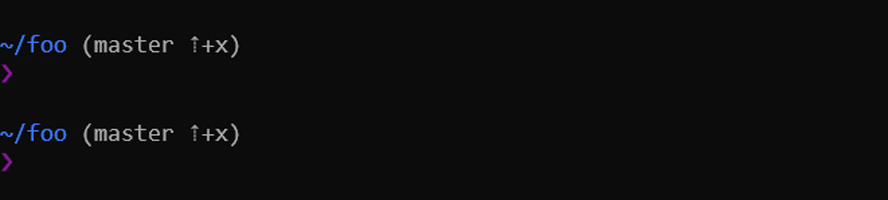

```sh
AGKOZAK_COLORS_BRANCH_STATUS=248
AGKOZAK_BLANK_LINES=1
AGKOZAK_LEFT_PROMPT_ONLY=1
# Make the unicode prompt character red when superuser
# and reversed when in vi command mode
AGKOZAK_PROMPT_CHAR=( '%F{magenta}❯%f' '%F{red}❯%f' '%F{magenta}❮%f' )
AGKOZAK_CUSTOM_SYMBOLS=( '⇣⇡' '⇣' '⇡' '+' 'x' '!' '>' '?' )
AGKOZAK_USER_HOST_DISPLAY=0
```
#### [borekb](https://github.com/agkozak/agkozak-zsh-prompt/pull/9)

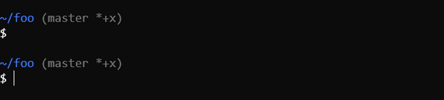

```sh
AGKOZAK_COLORS_BRANCH_STATUS=243
AGKOZAK_BLANK_LINES=1
AGKOZAK_LEFT_PROMPT_ONLY=1
# Make the prompt character more like that of bash
AGKOZAK_PROMPT_CHAR=( '$' '#' ':' )
AGKOZAK_USER_HOST_DISPLAY=0
```

#### [donkebap](https://github.com/donkebap/dotfiles/blob/a6fd36382c7f997156316173dd1ce898944bb0ae/dot_zshrc)

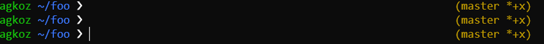

```sh
AGKOZAK_MULTILINE=0
AGKOZAK_PROMPT_CHAR=( ❯ ❯ ❮ )
```

#### [andeee](https://github.com/andeee/dotfiles/blob/ae53603fe69243ae4f3028d80e002af5630f40dd/zsh/.zshrc)

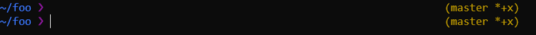

```sh
AGKOZAK_COLORS_PROMPT_CHAR='magenta'
AGKOZAK_MULTILINE=0
AGKOZAK_PROMPT_CHAR=( ❯ ❯ ❮ )
AGKOZAK_USER_HOST_DISPLAY=0
```

#### [DFG](https://github.com/tarkin88/DFG/blob/2bad488681cd5ca1ca2e59d9ed9d4409a949c0bb/dots/antigen/zshrc)

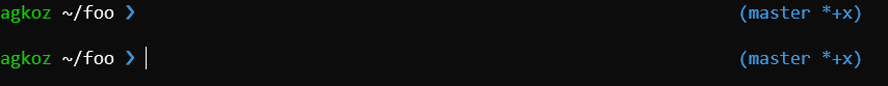

```sh
AGKOZAK_COLORS_PATH=grey
AGKOZAK_COLORS_BRANCH_STATUS=cyan
AGKOZAK_COLORS_PROMPT_CHAR=white
AGKOZAK_COLORS_PROMPT_CHAR=cyan

AGKOZAK_BLANK_LINES=1

AGKOZAK_PROMPT_CHAR=( ❯ ❯ ❮ )
```

#### [amenbreakfast](https://www.reddit.com/r/zsh/comments/cgiu1f/examples_of_agkozak_zsh_prompt_customization/euhsehg/)

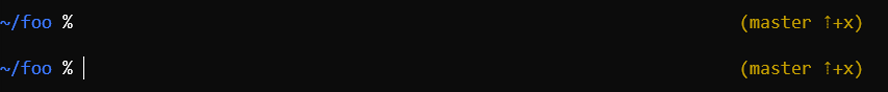

```sh
AGKOZAK_PROMPT_DIRTRIM=0

AGKOZAK_BLANK_LINES=1
AGKOZAK_MULTILINE=0
AGKOZAK_CUSTOM_SYMBOLS=( '⇣⇡' '⇣' '⇡' '+' 'x' '!' '>' '?' )
AGKOZAK_USER_HOST_DISPLAY=0
```

### Using `AGKOZAK_CUSTOM_PROMPT` and `AGKOZAK_CUSTOM_RPROMPT`

#### My Zenburn Custom Prompt

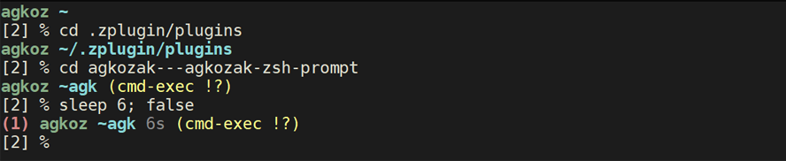

My Zenburn prompt tests first to make sure that the terminal has 256 colors; if not, the default colors of the prompt are used.

```sh
# Make sure the zsh/terminfo module is loaded
(( ${+modules[zsh/terminfo]} )) || zmodload zsh/terminfo
# If there are 256 colors, use the following colors; otherwise use the defaults
if (( ${terminfo[colors]:-0} >= 256 )); then
  AGKOZAK_COLORS_USER_HOST=108
  AGKOZAK_COLORS_PATH=116
  AGKOZAK_COLORS_BRANCH_STATUS=228
  AGKOZAK_COLORS_EXIT_STATUS=174
  AGKOZAK_COLORS_CMD_EXEC_TIME=245
  AGKOZAK_COLORS_VIRTUALENV=188
  AGKOZAK_COLORS_BG_STRING=223
fi
AGKOZAK_CUSTOM_PROMPT=''
# Command execution time
AGKOZAK_CUSTOM_PROMPT+='%(9V.%F{${AGKOZAK_COLORS_CMD_EXEC_TIME}}%b%9v%b%f .)'
# Exit status
AGKOZAK_CUSTOM_PROMPT+='%(?..%B%F{${AGKOZAK_COLORS_EXIT_STATUS}}(%?%)%f%b )'
# Username and hostname
AGKOZAK_CUSTOM_PROMPT+='%(!.%S%B.%B%F{${AGKOZAK_COLORS_USER_HOST}})%n%1v%(!.%b%s.%f%b) '
# Virtual environment indicator
AGKOZAK_CUSTOM_PROMPT+='%(10V.%F{${AGKOZAK_COLORS_VIRTUALENV}}[%10v]%f .)'
# Path
AGKOZAK_CUSTOM_PROMPT+='%B%F{${AGKOZAK_COLORS_PATH}}%2v%f%b'
# Background job status
AGKOZAK_CUSTOM_PROMPT+='%(1j. %F{${AGKOZAK_COLORS_BG_STRING}}%jj%f.)'
# Git status
AGKOZAK_CUSTOM_PROMPT+=$'%(3V.%F{${AGKOZAK_COLORS_BRANCH_STATUS}}%3v%f.)\n'
# SHLVL and prompt character
AGKOZAK_CUSTOM_PROMPT+='[%L] %(4V.:.%#) '
AGKOZAK_COLORS_BRANCH_STATUS=228

# No right prompt
AGKOZAK_CUSTOM_RPROMPT=''
```

#### [gnumoksha](https://github.com/gnumoksha/dotfiles/blob/e48d195c58abbedee65976b41d9cdf35a4716c7a/shell/zsh/agkozak-settings.zsh)

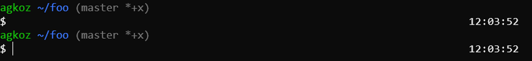

```sh
AGKOZAK_PROMPT_DIRTRIM=4
AGKOZAK_COLORS_BRANCH_STATUS=243
AGKOZAK_LEFT_PROMPT_ONLY=1
# The prompt character is always $
AGKOZAK_PROMPT_CHAR=( '$' '$' '$'  )

# Display the time in the right prompt
AGKOZAK_CUSTOM_RPROMPT='%*'
```

#### [pjcj](https://github.com/pjcj/base/blob/6138f2310fbabd809b3b10b1e279bbaff4ccbe05/.zshrc)

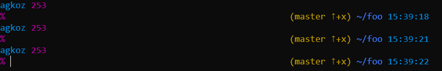

```sh
AGKOZAK_PROMPT_DIRTRIM=0
AGKOZAK_CUSTOM_SYMBOLS=( '⇣⇡' '⇣' '⇡' '+' 'x' '!' '>' '?' )

AGKOZAK_CUSTOM_PROMPT='%(?..%B%F{red}(%?%)%f%b )'
# Command execution time
AGKOZAK_CUSTOM_PROMPT+='%(9V.%9v .)'
AGKOZAK_CUSTOM_PROMPT+='%(!.%S%B.%B%F{32})%n%1v%(!.%b%s.%f%b)'
# Display the current history event number
AGKOZAK_CUSTOM_PROMPT+=' %B%F{13}%h%f%b'
AGKOZAK_CUSTOM_PROMPT+=$'\n%F{13}%(4V.:.%#)%f '

# Git status
AGKOZAK_CUSTOM_RPROMPT='%(3V.%F{yellow}%3v%f.) '
# Background jobs indicator
AGKOZAK_CUSTOM_RPROMPT+='%(1j.%F{magenta}%jj%f .)'
# Virtual environment indicator
AGKOZAK_CUSTOM_RPROMPT+='%(10V.%F{green}[%10v]%f .)'
# Display the path (substituting ~ for $HOME and in named directories)
AGKOZAK_CUSTOM_RPROMPT+='%B%F{blue}%~%f%b '
# Display the time
AGKOZAK_CUSTOM_RPROMPT+='%F{32}%*'
```

#### [AGitBoy](https://github.com/agkozak/agkozak-zsh-prompt/issues/15)

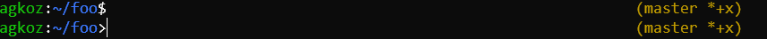

```sh
AGKOZAK_CUSTOM_PROMPT='%(?..%B%F{red}(%?%)%f%b)'
# Command execution time
AGKOZAK_CUSTOM_PROMPT+='%(9V.[%9v].)'
# Username and hostname
AGKOZAK_CUSTOM_PROMPT+='%(!.%S%B.%B%F{green})%n%1v%(!.%b%s.%f%b):'
# Path
AGKOZAK_CUSTOM_PROMPT+='%B%F{blue}%2v%f%b'
# Virtual environment indicator
AGKOZAK_CUSTOM_PROMPT+='%(10V.:%F{green}%10v%f.)'
# Background jobs indicator
AGKOZAK_CUSTOM_PROMPT+='%(1j.:%F{magenta}%jj%f.)'
# Use > as the prompt character when in vi command mode
AGKOZAK_CUSTOM_PROMPT+='%(4V.>.%(!.#.$))'
```

#### [steinex_ (for Kerberos)](https://www.reddit.com/r/zsh/comments/cgiu1f/examples_of_agkozak_zsh_prompt_customization/eultop7/)

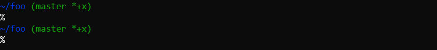

```sh
AGKOZAK_PROMPT_DIRTRIM=5

# Output the prompt character (normally %; %% for active kerberos principal)
krbprinc() {
  if klist -s; then
    print '%B%%%%%b'
    else
    print '%B%%%b'
  fi
}

AGKOZAK_CUSTOM_PROMPT=''
# Command execution time
AGKOZAK_CUSTOM_PROMPT+='%(9V.%9v .)'
_agkozak_is_ssh && AGKOZAK_CUSTOM_PROMPT+='%(!.%S%B.%B)%m%(!.%b%s.%b) '
AGKOZAK_CUSTOM_PROMPT+='%F{blue}%2v%f%b'
# Virtual environment indicator
AGKOZAK_CUSTOM_PROMPT+='%(10V. %F{default}[%10v]%f.)'
# Background jobs indicator
AGKOZAK_CUSTOM_PROMPT+='%(1j. %F{magenta}%jj%f.)'
# Git status
AGKOZAK_CUSTOM_PROMPT+=$'%(3V.%F{green}%3v%f.)\n'
# Kerberos status
AGKOZAK_CUSTOM_PROMPT+='$(krbprinc) '

AGKOZAK_CUSTOM_RPROMPT=''
```
# Options Index

Option | Default | Meaning
--- | --- | ---
[`AGKOZAK_BG_STRING`](#background-jobs-status) | `j` | The symbol or symbols to display next to the background jobs count
[`AGKOZAK_BLANK_LINES`](#blank-lines-between-prompts) | `0` | Display a blank line before displaying the prompt
[`AGKOZAK_BRANCH_STATUS_SEPARATOR`](#AGKOZAK_BRANCH_STATUS_SEPARATOR) | ` ` | Character or characters preceding the Git status indicator
[`AGKOZAK_CMD_EXEC_TIME_CHARS`](#command-execution-time) | `( '' '' )` | Strings to prepend and append to the command execution time indicator
[`AGKOZAK_CMD_EXEC_TIME`](#command-execution-time) | `5` | Threshold beyond which to display command execution time (in seconds)
[`AGKOZAK_COLORS_BG_STRING`](#custom-colors) | `magenta` | Color of the background jobs indicator
[`AGKOZAK_COLORS_BRANCH_STATUS`](#custom-colors) | `yellow` | Color of Git status
[`AGKOZAK_COLORS_CMD_EXEC_TIME`](#command-execution-time) | `default` | Color of command execution time indicator
[`AGKOZAK_COLORS_EXIT_STATUS`](#custom-colors) | `red` | Color of exit status
[`AGKOZAK_COLORS_PATH`](#custom-colors) | `blue` | Color of path
[`AGKOZAK_COLORS_PROMPT_CHAR`](#custom-colors) | `default` | Color of prompt character
[`AGKOZAK_COLORS_USER_HOST`](#custom-colors) | `green` | Color of username and hostname
[`AGKOZAK_COLORS_VIRTUALENV`](#virtual-environments) | `green` | Color of the virtual environment indicator
[`AGKOZAK_CUSTOM_PROMPT`](#advanced-customization) | | Code for custom left prompt
[`AGKOZAK_CUSTOM_RPROMPT`](#advanced-customization) | | Code for custom right prompt
[`AGKOZAK_CUSTOM_SYMBOLS`](#custom-git-symbols) | `( '&*' '&' '*' '+' 'x' '!' '>' '?' '$' )` | Array containing custom Git symbols for the statuses Diverged, Behind, Ahead, New file(s), Deleted, Modified, Renamed, Untracked, Stashed changes
[`AGKOZAK_FORCE_ASYNC_METHOD`](#asynchronous-methods) | | Forces the asynchronous method to be `subst-async`, `zsh-async`, `usr1` or `none`
[`AGKOZAK_LEFT_PROMPT_ONLY`](#optional-left-prompt-only-mode) | `0` | Display a two-line prompt with the Git status on the left side
[`AGKOZAK_MULTILINE`](#optional-single-line-prompt) | `1` | Display a two-line prompt
[`AGKOZAK_NAMED_DIRS`](#abbreviated-paths) | `1` | Display named (hashed) directories thus: `~foo`
[`AGKOZAK_PRE_PROMPT_CHAR`](#optional-single-line-prompt) | ` ` | For a single-line prompt, the character or characters to display before the prompt character
[`AGKOZAK_PROMPT_DEBUG`](#asynchronous-methods) | `0` | Show debugging information
[`AGKOZAK_PROMPT_DIRTRIM`](#abbreviated-paths) | `2` | Number of directory elements to display; `0` turns off directory trimming
[`AGKOZAK_PROMPT_DIRTRIM_STRING`](#abbreviated-paths) | `...` | Ellipsis string used in directory trimming
[`AGKOZAK_SHOW_BG`](#background-jobs-status) | `1` | Display the number of background jobs you hav running
[`AGKOZAK_SHOW_STASH`](#agkozak_show_stash) | `1` | Display stashed changes
[`AGKOZAK_SHOW_VIRTUALENV`](#virtual-environments) | `1` | Display virtual environments
[`AGKOZAK_USER_HOST_DISPLAY`](#agkozak_user_host_display) | `1` | Display the username and hostname
[`AGKOZAK_VIRTUALENV_CHARS`](#virtual-environments) | `( '[' ']' )` | Characters to put around the virtual environment name

# `psvar` Index

`psvar` Element | Prompt String Equivalent | Usage
--- | --- | ---
`psvar[1]` | `%1v` | "@" sign and abbreviated hostname, displayed for SSH connection (e.g. `@machine`)
`psvar[2]` | `%2v` | Working directory or abbreviation thereof
`psvar[3]` | `%3v` | Working Git branch and indicator of changes made, surrounded by parentheses and preceded by `AGKOZAK_PRE_PROMPT_CHAR` (usually a space), e.g. ` (master !?)`
`psvar[4]` | `%4v` | `vicmd` when vi command mode is enabled; otherwise empty
`psvar[5]` | `%5v` | Empty only when `AGKOZAK_USER_HOST_DISPLAY` is `0` (deprecated; kept for legacy custom prompts)
`psvar[6]` | `%6v` | Just the Git branch name, e.g. `master`
`psvar[7]` | `%7v` | Just the Git symbols, e.g. `!?`
`psvar[8]` | `%8v` | Previous command's execution time in seconds; only set if `AGKOZAK_CMD_EXEC_TIME` > 0 and if the execution time exceeded `AGKOZAK_CMD_EXEC_TIME`
`psvar[9]` | `%9v` | `psvar[8]` pretty-printed as days, hours, minutes, and seconds, thus: `1d 2h 3m 4s`
`psvar[10]` | `%10v` | Name of any virtual environment that has been activated
`psvar[11]` | `%11v` | The number of background jobs running (deprecated; please use `%j` instead)

<hr>

<p align="center">
  
</p>
